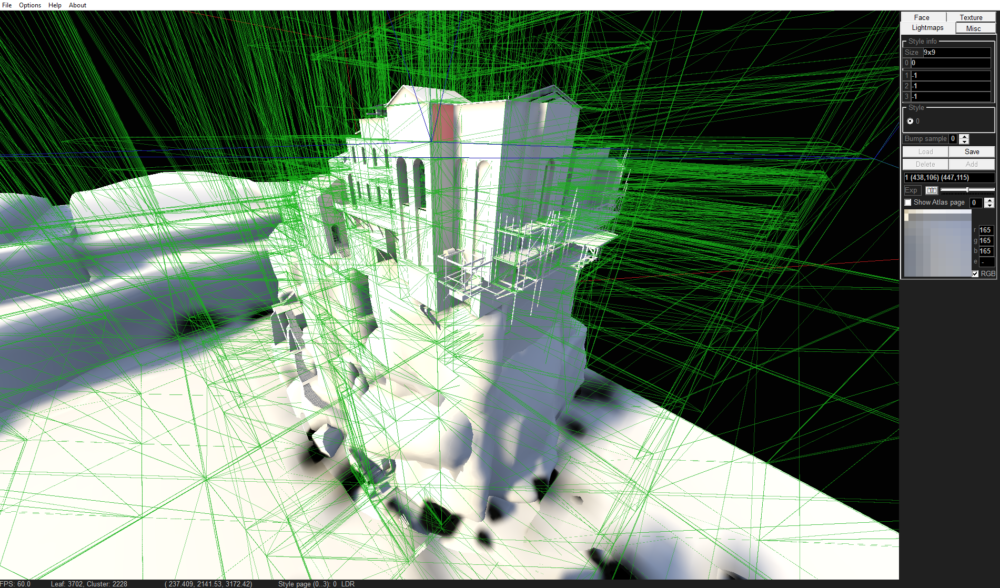

Copyright (c) 2019-2025 Sergey-KoRJiK, Belarus

# This programm created for View and Edit Source Engine BSP maps.
- Lightmap atlas preview, per-pixel preview, save to file styles and bumps
- leaf BBOX preview
- HDR\LDR tonemap exposure slider
- hide\show triggers, BModels
- Face select info (vertices, plane, disp, texinfo)
- dev build 1.1.1 include only lightmap & leaf preview, no ambient cubes now

